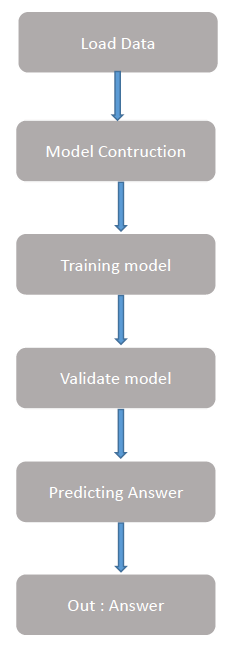

# Classification Report_109318137

## 1.作法說明

本次作業在本地端完成
</br>
作業環境:
</br>
Ubuntu 18.04
</br>
Python
</br>
硬體設備:
</br>
CPU:intel i7-9700
</br>
GPU:GeForce RTX 2080 Ti 


1. 本次作業沒有驗證集，在訓練模型時需自行從測試集分出部分資料當作驗證集。
</br>

2. 使用自行建構的簡單CNN模型來預測
</br>

3. 最後將test data放進模型做預測，再將結果寫入csv檔後上傳kaggle集完成本次作業。
</br>


## 2.程式方塊圖與寫法
程式方塊圖如下:
</br>

 - Import moudules
    ```py
    # 匯入相關所需的模組
    import os,sys
    import numpy as np
    import cv2
    import matplotlib.pyplot as plt
    from PIL import Image
    from random import shuffle
    os.environ['CUDA_VISIBLE_DEVICES']='0'
    from sklearn.model_selection import train_test_split

    import tensorflow as tf
    from keras.preprocessing.image import ImageDataGenerator
    from keras.callbacks import ModelCheckpoint
    from keras.models import Sequential
    from keras.layers import *
    from keras.optimizers import *
    from keras import utils as np_utils

    def solve_cudnn_error():    #用來解決訓練時發生的cudnn錯誤
        gpus = tf.config.experimental.list_physical_devices('GPU')
        if gpus:
            try:
                # Currently, memory growth needs to be the same across GPUs
                for gpu in gpus:
                    tf.config.experimental.set_memory_growth(gpu, True)
                logical_gpus = tf.config.experimental.list_logical_devices('GPU')
                print(len(gpus), "Physical GPUs,", len(logical_gpus), "Logical GPUs")
            except RuntimeError as e:
                # Memory growth must be set before GPUs have been initialized
                print(e)

    solve_cudnn_error() 
    ```
 - Load data
    將照片讀取出來，並縮放成64*64的大小來避免記憶體用量過高與加快訓練時間
    ```py

    def read_images_labels(path,i):
        for file in os.listdir(path):
            abs_path=os.path.abspath(os.path.join(path,file))
            if os.path.isdir(abs_path):
                i+=1
                temp=os.path.split(abs_path)[-1]
                name.append(temp)
                read_images_labels(abs_path,i)
                amount=int(len(os.listdir(path)))
                sys.stdout.write('\r'+'>'*(i)+' '*(amount-i)+'[%s%%]'%(i*100/amount)+temp)
            else:
                if file.endswith('.jpg'):
                    image = cv2.resize(cv2.imread(abs_path),(64,64))
                    images.append(image)
                    labels.append(i-1)
        return images, labels, name 

    def read_main(path):
        images, labels, name = read_images_labels(path,i=0)
        images=np.array(images,dtype=np.float32)/255
        labels=np_utils.to_categorical(labels, num_classes=20)
        np.savetxt('name.txt',name,delimiter=' ',fmt="%s")
        return images, labels

    images=[]
    labels=[]
    name=[]
    images,labels=read_main('simpsondata/train/characters-20')
    X_train,X_test,Y_train,Y_test=train_test_split(images,labels,test_size=0.2) #將資料拆分成訓練集與驗證集

    ```
    
- model construction

    模型建構如下

    ```py
    model = Sequential()
    model.add(Conv2D(64, (3, 3), padding='same', activation='relu', input_shape=X_train.shape[1:]))
    model.add(Conv2D(256, (3, 3), padding='same', activation='relu'))
    model.add(MaxPooling2D(pool_size=(2, 2)))
    model.add(Dropout(0.2))
        
    model.add(Conv2D(256, (3, 3), padding='same', activation='relu'))
    model.add(Conv2D(256, (3, 3), padding='same', activation='relu'))
    model.add(Conv2D(256, (3, 3), padding='same', activation='relu'))
    model.add(MaxPooling2D(pool_size=(2, 2)))
    model.add(Dropout(0.5))
        
    model.add(Conv2D(256, (3, 3), padding='same', activation='relu'))
    model.add(MaxPooling2D(pool_size=(2, 2)))
    model.add(Dropout(0.2))
        
    model.add(Flatten())
    model.add(Dense(512, activation='relu'))
    model.add(Dropout(0.5))
        
    model.add(Dense(20, activation='softmax'))
        

    model.summary() # 秀出模型架構
    ```
    模型資訊如下

    ```py
    Model: "sequential"
    _________________________________________________________________
    Layer (type)                 Output Shape              Param #   
    =================================================================
    conv2d (Conv2D)              (None, 64, 64, 64)        1792      
    _________________________________________________________________
    conv2d_1 (Conv2D)            (None, 64, 64, 256)       147712    
    _________________________________________________________________
    max_pooling2d (MaxPooling2D) (None, 32, 32, 256)       0         
    _________________________________________________________________
    dropout (Dropout)            (None, 32, 32, 256)       0         
    _________________________________________________________________
    conv2d_2 (Conv2D)            (None, 32, 32, 256)       590080    
    _________________________________________________________________
    conv2d_3 (Conv2D)            (None, 32, 32, 256)       590080    
    _________________________________________________________________
    conv2d_4 (Conv2D)            (None, 32, 32, 256)       590080    
    _________________________________________________________________
    max_pooling2d_1 (MaxPooling2 (None, 16, 16, 256)       0         
    _________________________________________________________________
    dropout_1 (Dropout)          (None, 16, 16, 256)       0         
    _________________________________________________________________
    conv2d_5 (Conv2D)            (None, 16, 16, 256)       590080    
    _________________________________________________________________
    max_pooling2d_2 (MaxPooling2 (None, 8, 8, 256)         0         
    _________________________________________________________________
    dropout_2 (Dropout)          (None, 8, 8, 256)         0         
    _________________________________________________________________
    flatten (Flatten)            (None, 16384)             0         
    _________________________________________________________________
    dense (Dense)                (None, 512)               8389120   
    _________________________________________________________________
    dropout_3 (Dropout)          (None, 512)               0         
    _________________________________________________________________
    dense_1 (Dense)              (None, 20)                10260     
    =================================================================
    Total params: 10,909,204
    Trainable params: 10,909,204
    Non-trainable params: 0
    _________________________________________________________________
    ```

    模型建置參數如下，這邊callback函數使用了checkpoint來將訓練過程中validat_accuracy最高的epoch的權重儲存起來。

    ```py
    model.compile(loss='categorical_crossentropy',
             optimizer='adam',
             metrics=['accuracy'])
    filepath="weights.best.hdf5"
    checkpoint = ModelCheckpoint(filepath, monitor='val_accuracy', verbose=1, save_best_only=True,mode='max')
    callbacks_list= [checkpoint]
    ```

- traing model

    模型訓練如下

    ```py
    start=time.time()
    epochs=20
    batch_size=256
    history = model.fit(X_train, Y_train,
            batch_size=batch_size,
            epochs=epochs,
            validation_data=(X_test, Y_test),
            shuffle=True,verbose=1,callbacks=callbacks_list)
    ```
- validate model

   將訓練過程的loss與accuracy畫出來，觀察是否有under fitting或overfitting的現象

    ```py

    import matplotlib.pyplot as plt

    def plot_train_history(history, train_metrics, val_metrics):
        plt.plot(history.history.get(train_metrics),'-o')
        plt.plot(history.history.get(val_metrics),'-o')
        plt.ylabel(train_metrics)
        plt.xlabel('Epochs')
        plt.legend(['train', 'validation'])      
    plt.figure(figsize=(12,4))
    plt.subplot(1,2,1)
    plot_train_history(history, 'loss','val_loss')

    plt.subplot(1,2,2)
    plot_train_history(history, 'accuracy','val_accuracy')

    plt.show()
    ```
    

- predicting answer

    將val_accuracy最高的weight load進model裡

    ```py
    model.load_weights("weights.best.hdf5")
    score=model.evaluate(X_test,Y_test,verbose=1)
    print(score) #確認val_accuracy是否與訓練時相同
    ```    
    讀取test data後丟進模型進行預測
    ```py
    import os 
    DIR = 'simpsondata/test/test' #test data的資料夾
    image_len=len([name for name in os.listdir(DIR) if os.path.isfile(os.path.join(DIR, name))]) 
    
    def read_images(path):
        test_images=[]
        for i in range(image_len):
                img = cv2.resize(cv2.imread(path+str(i+1)+'.jpg'),(64,64))
                test_images.append(img)   
        test_images=np.array(test_images,dtype=np.float32)/255.
        return test_images
    test_img = read_images(DIR)
    pred = model.predict_classes(test_img,verbose=1)
    ```

- output Answer
    將預測結果轉回角色名稱
    ```py
    nametxt=np.loadtxt('name.txt',dtype='str')
    name_label=[]
    name_num=0
    for i in nametxt:
        name_label.append([name_num,i])
        name_num+=1
    new_pred=[]
    for i in range(len(pred)):
        new_pred.append(name_label[pred[i]][1])
    ```

    最後將預測結果寫入csv檔


## 3.如何改進

1. 在訓練圖像辨識的模型時，data set的數量與品質往往是影響最大的一環，data set若盡可能涵蓋到各種有機會出現的可能將能夠改善預測準度，常見的方法為data Agumentation，透過各種影像處理，如水平/垂直翻轉、裁切、旋轉、縮放、改變亮度/對比、增加雜訊......等等方式來盡可能增加資料集。
</br>

2. 目前已有許多強大的pre-train CNN model在市面上，這些model都已經經過非常多資料的訓練及調整，效能基本上都會比自己建構的CNN模型來的好，可以利用這些強大的model當作基礎並放入自己的資料級進行訓練。
</br>

3. 每個類別可能適合不同的model來進行預測，可嘗試用多種model來訓練，調查哪些情況使用哪一個模型最準確，並加入regressor來做輸出選擇，可以讓整個模型更加強大。
